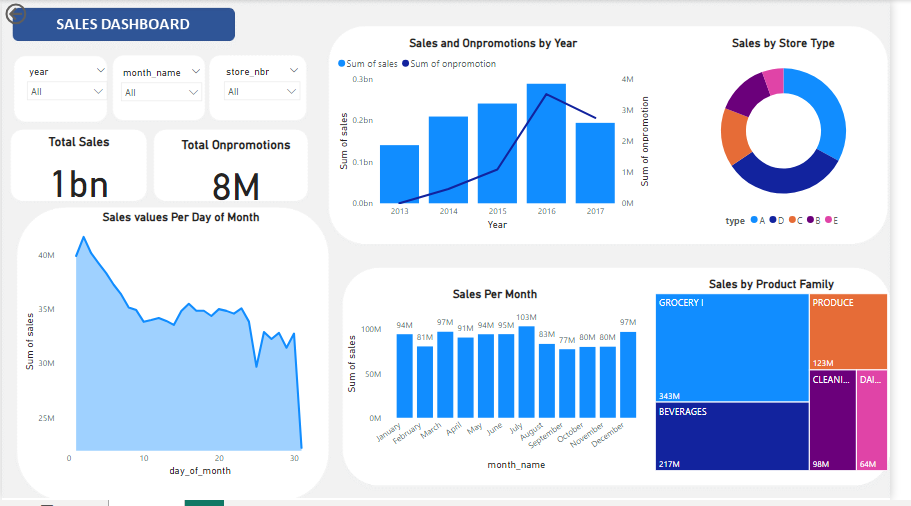

<a name="readme-top"></a>

<div align="center">
  <h1><b>Corporation Favorita Time Series Regression Analysis/b></h1>
</div>

<!-- TABLE OF CONTENTS -->

# 📗 Table of Contents

- [📗 Table of Contents](#-table-of-contents)
- [Project Description ](#Time-Series-Analysis)
  - [🛠 Built with ](#-built-with-)
    - [Tech Stack ](#tech-stack-)
  - [Key Insights ](#key-features-)
  - [💻 Getting Started ](#-getting-started-)
    - [Prerequisites](#prerequisites)
    - [Setup](#setup)
  - [👥 Authors ](#-authors-)
  - [🤝 Contributing ](#-contributing-)
  - [⭐️ Show your support ](#️-show-your-support-)
  - [🙏 Acknowledgments ](#-acknowledgments-)
  - [📝 License ](#-license-)

<!-- PROJECT DESCRIPTION -->

# Corporation Favorita Time Series Analysis <a name="about-project"></a>

**# Corporation Favorita: Time Series Regression Analysis** Corporation Favorita, a leading Ecuadorian grocery retailer, aims to mitigate the risk of stockouts and excess inventory costs by developing a machine learning model to predict the likelihood of products running out of stock. Understanding the key indicators of low stock levels and implementing effective inventory management strategies are crucial for maintaining customer satisfaction and maximizing profitability.

1. **date**:date the sales were made
2. **store_nbr**:Identifier for the store where the products are sold
3. **family**:Category or type of product sold
4. **sales**:Total sales for a product family at a particular store on a given date. Fractional values are possible, indicating partial units sold (e.g., 1.5 kg of cheese)
5. **onpromotion**: Total number of items in a product family that were being promoted at a store on a given date
Columns From Other Tables Used for Analysis
6. **city**: the city a store is situated from the store table
7. **state**: state a city is found in from the store table
9. **type**: type of store from the store table
10. **cluster**: Cluster of stores
11. **locale**: From the holiday table, indicates whether a holiday is local,regional or national from holiday table
12. **holiday-type**: Type of holiday event
13. **locale-name**: Name of the holiday locale
14. **description**: description of holiday
15. **transferred**: Indicates whether the holiday was transferred to other day or not
16. **dcoilwtico**: Oil price.

## 🛠 Built With <a name="Technologies Used"></a>
To guide this project, I will be using the CRISP-DM (Cross-Industry Standard Process for Data Management). There are 6 stages in this framework, namely: business understanding, data understanding, data preparation, modelling, model evaluation, and model deployment. This project utilized the first five stages of the framework. It also involved a variety of technologies, programming languages, and libraries to process, analyze, and visualize the data. The following tools were utilized:
4. _Python_: Python programming language was the backbone of the project, used for data processing, analysis, and visualization tasks.
5. _Pandas_ and NumPy: Pandas and NumPy libraries were essential for data manipulation and numerical computations.
6. _Matplotlib and Seaborn_: Matplotlib and Seaborn were employed for data visualization, creating insightful charts and graphs to represent the findings.
7. _Visual Studio Code and Jupyter Notebooks_: Jupyter Notebooks within the Visual Studio IDE provided an interactive environment for running code, visualizing data, and documenting the analysis process.
8. _Scikit-learn_: Scikit-learn's library SimpleImputer was utilized for imputing null values in the amount column.
9. _statsmodels_: is a powerful Python library for statistical modeling and econometrics. It provides classes and functions for the estimation of many different statistical models, including linear regression, generalized linear models, robust linear models, mixed-effects models, and more. In time series analysis, statsmodels offers a suite of tools and models that are particularly useful. 
10. _scipy_: SciPy is a free and open-source Python library used for scientific computing and technical computing. SciPy contains modules for optimization, linear algebra, integration, interpolation, special functions, FFT, signal and image processing, ODE solvers and other tasks common in science and engineering.
11. _SQL_: Structured Query Language (SQL) was used for database querying and data retrieval when needed.
12. _GitHub_: GitHub served as the version control system for the project, enabling collaboration and tracking changes in the codebase.
    These technologies played a crucial role in the successful implementation of the project, providing the necessary tools to analyze and derive insights from the time series data.

<details>
  <summary>Data Sources</summary>
  <p>This project utilizes datasets from three distinct sources. The training and transaction datasets were obtained from Azubi Africa’s GitHub repository. The oil data, holiday data, and store data are hosted on a remote Microsoft SQL database, which will be accessed using provided credentials. These datasets will be integrated with the training data for comprehensive data analysis and to address key business questions. Additionally, the test data and sample submission data are available on OneDrive.</p>
</details>

<details>
<summary>Database</summary>
  <ul>
    <li><a href="">Microsoft SQL Server</a></li>
  </ul>
</details>

<details>
<summary>Language</summary>
  <ul>
    <li><a href="">Python</a></li>
  </ul>
</details>


<p align="right">(<a href="#readme-top">back to top</a>)</p>
<!-- Features -->

## Success Criteria <a name="key-features"></a>
- Model RMSLE score <= 0.2 
- Implemented inventory management strategies should result in measurable reductions in stockouts and excess inventory costs.
- The model should contribute to optimizing inventory levels and minimizing revenue losses due to stock shortages.
- Customer satisfaction levels should be maintained or improved through consistent product availability.
- The model should be adaptable to changing market conditions and scalable to accommodate larger datasets or additional features.
- Continuous feedback loops should refine inventory management strategies based on model predictions and business performance. 

## Key Insights <a name="key-Insights"></a>
The analysis of the Corporation Favorita store using the three separate data sorces yielded valuable insights into the sales trends and dynamics within the store. Based on the EDA and visualizations conducted, the following key findings and conclusions have been drawn:
1. _Data Completeness_:
   - The train dataset is not complete for all required dates. There are missing dates spanning from January 1, 2013, to August 15, 2017, totaling 1688 missing dates. This means that there are gaps in the dataset, and it does not contain records for these specific dates.
   - These missing dates could be of significance as the project is to analyze sales data over a continuous time period. Based on our project goals, we need to consider how to handle these gaps in the data, such as thorough data imputation or by excluding these missing dates from our analysis, to ensure that we are working with a complete and continuous time series. The missing dates present in the training data were filled in, and the corresponding values in the sales and on-promotion columns were filled with zeros, indicating the store wasn’t opened on those days.
2. _Sales Per Year and Month_:
   - Throughout the years from 2013 to 2017, a recurring pattern emerged in the sales data. On January 1st of each year, sales hit their lowest point, indicating a consistent trend of minimal sales activity at the start of each year. Conversely, the sales peak consistently occurred towards the end of each year, particularly on December 23rd, with remarkable figures. However, in the year 2016, there was a notable deviation from this pattern, with the highest sales recorded on the 18th of April. This suggests a unique sales trend for that specific year. In 2017, the highest sales day shifted to April 1st, marking a departure from the usual year-end peak observed in previous years.
   - These findings highlight the seasonality and variation in sales patterns over the years, potentially influenced by holidays and promotional events.
3. _Impact of Earthquake on Sales_:
  - Sales Before Earthquake (Left Side of Vertical Line): Before the earthquake, sales seem to be following a declining pattern with some fluctuations but no major disruptions.
  - Sales After Earthquake (Right Side of Vertical Line): Immediately following the earthquake (to the right of the vertical line), there is a noticeable shift in the sales pattern. Sales increase significantly, indicating a surge in purchasing activity as people buy more items in response to the event.
  - Post-Earthquake Trend: The trend line after the earthquake shows an upward trajectory, suggesting a significant increase in sales. Over the subsequent days, sales data eventually return to the declining pattern observed before the earthquake.
4.  _Are certain groups of stores selling more products?_:
   - City Analysis: Quito stands out among the cities with significantly higher total sales compared to others, making it the top-performing city in terms of sales. Guayaquil follows with substantial but lower total sales. This indicates that Quito and Guayaquil are key revenue-generating cities for the stores.

   - Cluster Analysis: Cluster 14 is the cluster with the highest total sales, as seen by the fact that it leads the group with the highest overall sales when sales by cluster are examined. While at a slightly lower level, clusters 6, 8, 11, and 10 also exhibit strong performance. This analysis demonstrates how sales success varies throughout the various clusters, with Cluster 14 clearly setting the standard.

   - State Analysis: Pichincha has the highest total sales among the states, significantly surpassing the others. Guayas follows with a substantial yet lower sales figure. This indicates that stores in Pichincha and Guayas contribute significantly to overall sales, highlighting regional variations in sales performance.

   - Store Type Analysis: Among the store types, stores A and D lead in total sales, indicating that they generate the highest revenue. Store C, B and E also perform well, but at a lower level. This analysis underscores the impact of store type on sales, with A and B stores significantly outperforming others in terms of revenue generation.

   - In conclusion, this analysis can guide strategic decision-making for store management, helping them focus resources and efforts on high-performing groups to further enhance sales and overall profitability.
5. _Are sales affected by promotions, oil prices and holidays_
   - Sales vs Promotions: The number of promotions on a particular product or in a particular store had a significant impact on sales. This further disproves our null hypothesis that product promotions has no significant impact on sales

   - Sales vs. holiday events: During holiday periods, sales at Corporation Favorita typically experience a notable increase compared to regular days. This surge can be attributed to the fact that many individuals are at home, enjoying the holiday break, and consequently, have a heightened demand for goods. Recognizing this trend presents an opportunity for the company to capitalize on increased consumer activity by scaling up its operations. By strategically increasing the number of workers and extending operating hours during these peak periods, Corporation Favorita can effectively meet the heightened demand, ultimately driving higher sales and maximizing revenue potential.

   - Sales vs Oil Price: From my analysis, it can be seen that there is a significance relationship between store sales and oil prices at Corporation Favorita. It is observed that sales tend to increase when oil prices in the Ecuadorian market decrease.

6. _Strategic Implications_:
   Our findings underscore the importance of leveraging advanced machine learning techniques, such as XGBoost, in forecasting future sales with precision and accuracy. The visualization of feature importance highlights the crucial role of variables like “sales_diff,” “moving_average_sales,” and “onpromotion” in driving predictive performance, providing actionable insights for retailers to optimize inventory management and promotional strategies.


<p align="right">(<a href="#readme-top">back to top</a>)</p>


<!-- GETTING STARTED -->

## 💻 Getting Started <a name="getting-started"></a>


To get a local copy up and running, follow these steps.

### Prerequisites

In order to run this project you need:

- Python


### Setup

Clone this repository to your desired folder:


```sh
  cd my-folder
  git clone https://github.com/adubrightkwartengsnr/Time-Series-Regression-Analysis-Corporation-Favorita
```

Change into the cloned repository

```sh
  cd Time-Series-Regression-Analysis-Corporation-Favorita
  
```

Create a virtual environment

```sh

python -m venv env

```

Activate the virtual environment

```sh
    env/Scripts/activate
```


### Install

Here, you need to recursively install the packages in the `requirements.txt` file using the command below 

```sh
   pip install -r requirements.txt
```


<!-- AUTHORS -->

## 👥 Authors <a name="authors"></a>

🕵🏽‍♀️ **Bright Adu Kwarteng Snr**

- GitHub: [GitHub Profile](https://github.com/adubrightkwartengsnr)
- LinkedIn: [LinkedIn Profile](www.linkedin.com/in/bright-adu-kwarteng-snr)

<p align="right">(<a href="#readme-top">back to top</a>)</p>

<!-- FUTURE FEATURES -->

## 🔭 Future Features <a name="future-features"></a>
Moving forward, further research could explore additional features, such as customer demographics or external economic indicators, to enhance the predictive power of our models. Additionally, the application of advanced techniques like deep learning or ensemble methods may offer even greater accuracy in forecasting sales outcomes.
    
<p align="right">(<a href="#readme-top">back to top</a>)</p>

<!-- CONTRIBUTING -->

## 🤝 Contributing <a name="contributing"></a>

Contributions, issues, and feature requests are welcome!

Feel free to check the [issues page](../../issues/).

<p align="right">(<a href="#readme-top">back to top</a>)</p>

<!-- SUPPORT -->

## ⭐️ Show your support <a name="support"></a>

If you like this project kindly show some love, give it a 🌟 **STAR** 🌟

<p align="right">(<a href="#readme-top">back to top</a>)</p>

<!-- ACKNOWLEDGEMENTS -->

## 🙏 Acknowledgments <a name="acknowledgements"></a>

I would like to express my sincere gratitude to my instructors Racheal Appiah-Kubi and Violette Naa Adoley Allotey for their exceptional guidance, unwavering support, and invaluable mentorship throughout the course of this project. Their expertise, dedication, and commitment to our learning journey have been instrumental in shaping our understanding and skills in data analysis.

I would also like to extend a special thank you to Solomon Nyamson for his valuable advice and insights shared during the development of this project. His experiences and expertise in similar projects have been a source of inspiration and guidance, enriching our project with practical knowledge.


<p align="right">(<a href="#readme-top">back to top</a>)</p>

<!-- LICENSE -->

## 📝 License <a name="license"></a>

This project is [MIT](./LICENSE) licensed.

<p align="right">(<a href="#readme-top">back to top</a>)</p>

<p> align="right">(<a href="https://medium.com/@adubrightkwarrteng11/time-series-regression-analysis-a-deep-diving-into-forecasting-at-corporation-favorita-9f6f8671512c">Link to Article</a>)</p>


